## Project Overview  

#### The following is an exploration of a dataset on Netflix titles between 2008 to 2019. I load the dataset into an ipynb and perform some EDA and visualisations on it.  

Dataset file: [netflix titles dataset](netflix_titles.csv)  
Python notebook: [EDA Notebook](netflix.ipynb)  

## Metadata  
The dataset has 12 columns with 1 column being a unique identifier, and the remaining columns pertaining to a Netflix title as follows:  

type: movie/tv series  
title: title of the Netflix show  
director: director name of the title  
cast: cast involved in the title   
country: country that published the title   
date_added: date the title was added to Netflix  
release_year: the title's year of release  
rating: US's TV Parental Guidelines rating system, i.e. TV-PG, TV-MA, R, etc.  
duration: duration of the title in minutes/seasons  
listed_in: genres the title falls under  
description: a short description of the title  

## Data Cleaning/Exploration/Visualisation
There are some null values. I look to clean them up before exploring/visualizing.    
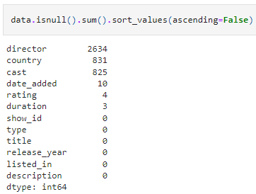  

### Duration 
<ins>Before</ins>:  
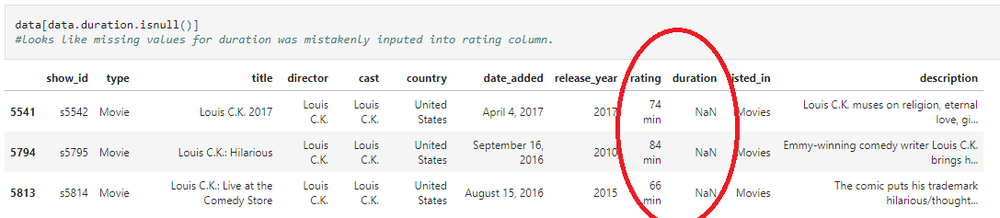    
I take the rating column values and replace the missing values in duration, and set the rating values to null.  
<ins>After</ins>:  

We note that duration across the <ins>type</ins> column differs between Movies and TV Shows:  
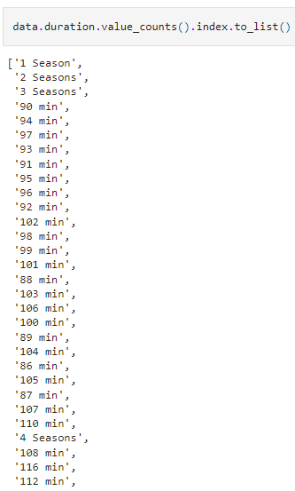  

Title by type:   
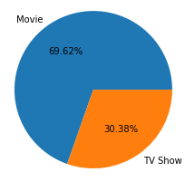  

#### Movie duration distribution  
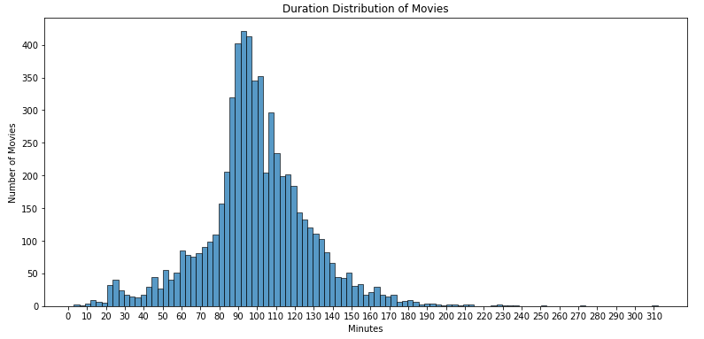  
The most common duration for movies are within 90-100 minutes.  

#### TV Show duration distribution  
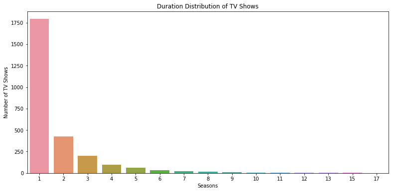  
Most TV shows have only 1 Season.  

### Ratings
   
We note the 4 null values + 3 additional rows from cleaning the duration column up earlier.  
#### Ratings by movies/tv shows
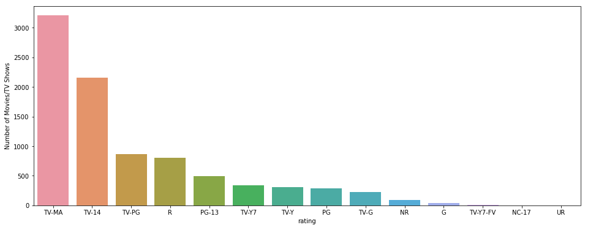  
As there are many ratings, we categorize them into simpler forms according to the Netflix's guidelines at https://help.netflix.com/en/node/2064/us:  

Kids  
TV-Y: Designed to be appropriate for all children  
TV-Y7: Suitable for ages 7 and up  
G: Suitable for General Audiences  
TV-G: Suitable for General Audiences  
PG: Parental Guidance suggested  
TV-PG: Parental Guidance suggested  

Teens    
PG-13: Parents strongly cautioned. May be Inappropriate for ages 12 and under.  
TV-14: Parents strongly cautioned. May not be suitable for ages 14 and under.  
  
Adults  
R: Restricted. May be inappropriate for ages 17 and under.  
TV-MA: For Mature Audiences. May not be suitable for ages 17 and under.  
NC-17: Inappropriate for ages 17 and under  

Zip to Dictionary and Map to Dataframe column  
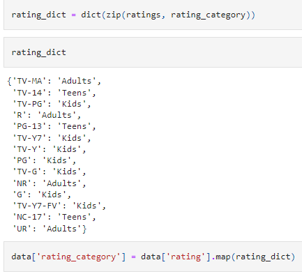  

#### Ratings after categorizing  
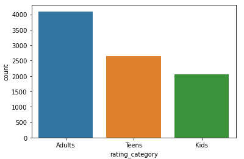    
About 23% of shows on Netflix are for Children, (30+23)% to Teenagers, and (47+30+23)% to Adults.  

#### Rating by title type    
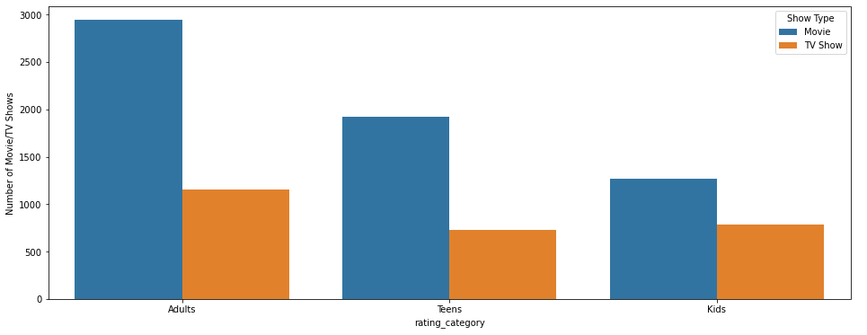      
Adult Movies are 48% of all movies in Netflix, followed by 31% being Teenager movies, and lastly 21% being Children movies.  
Adult TV Shows are 43% of all TV shows in Netflix, followed by 29% being Teenager TV shows, and lastly 27% being Children TV shows.  

### Genres
Genres are grouped together for each title.
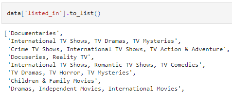      

Expand the grouped up genres per row into individual rows for each genre associated with each title.    
Look at all unique genres.    
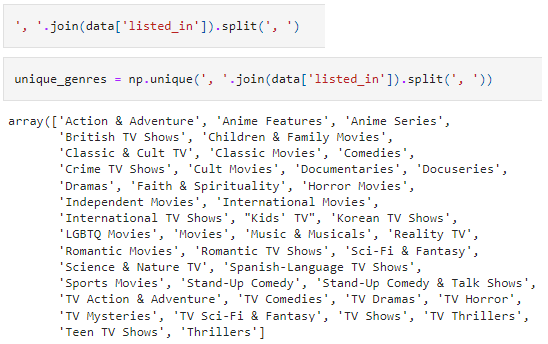  
There are overlapping genres, i.e. ('Movies', 'Horror Movies') but this is how Netflix has classified them so we will leave it be  

#### Genre distribution across all titles (Movies & TV Shows)    
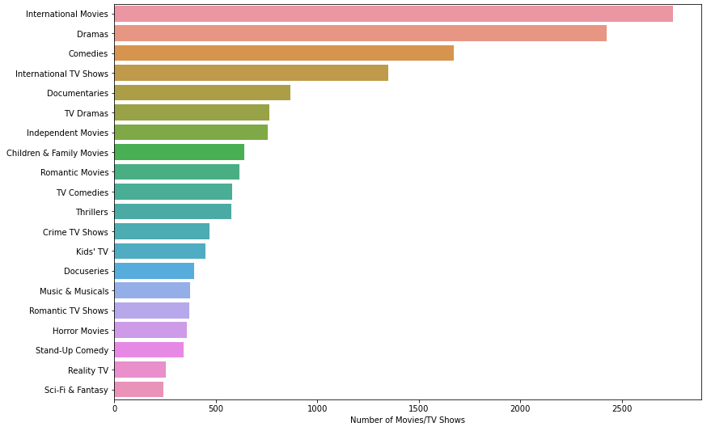  
International content, Dramas and Comedies are the most popular genres of content on Netflix.  
Movies and TV Shows have their own respective genres, i.e Romantic Movies, Romantic TV Shows, so I will be exploring them by their type next.  

#### Rating Category by Movies  
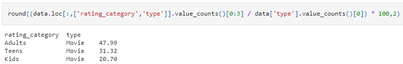  
  
#### Rating Category by TV Shows  
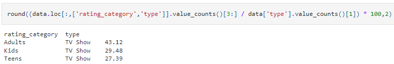  

TV Shows have a higher weightage in the Kids rating_category as compared to Movies.  
But since genres can overlap for a single TV show/Movie, we should look at the genre numbers against the total number of TV shows/movies for a more accurate representation of the genre distribution.  

#### Kids Rating Category by TV Show Genres  
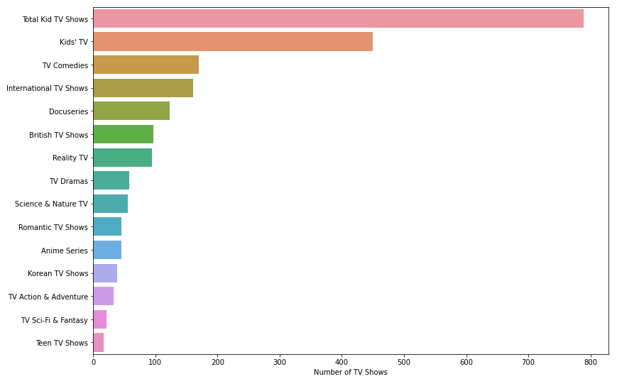  
About 57% of TV Shows with 'Kids' rating_category belong to the the "Kids' TV" genre.  
TV Comedies, International TV Shows, Docuseries follow after with only about half as many shows as the Kids' TV genre.  
 
These may not be genres that have a high appeal factor to children although they have been categorically rated as "Kids" TV Shows in the rating_category column. It could just mean that it is safe for Children to watch.  
 
However, as the genres are rather generic sounding, it is hard to ascertain that they definitely do not appeal to children, e.g. "International TV Shows" could also refer to a highly rated/popular children's show in another country.  
 
Under the assumption that these shows rated "Children" solely mean that they are safe for children to watch, only 57% of 789 TV Shows are meant to appeal to Netflix children audiences, which is not a very wide variety of shows.  

#### Kids Rating Category by Movie Genres  
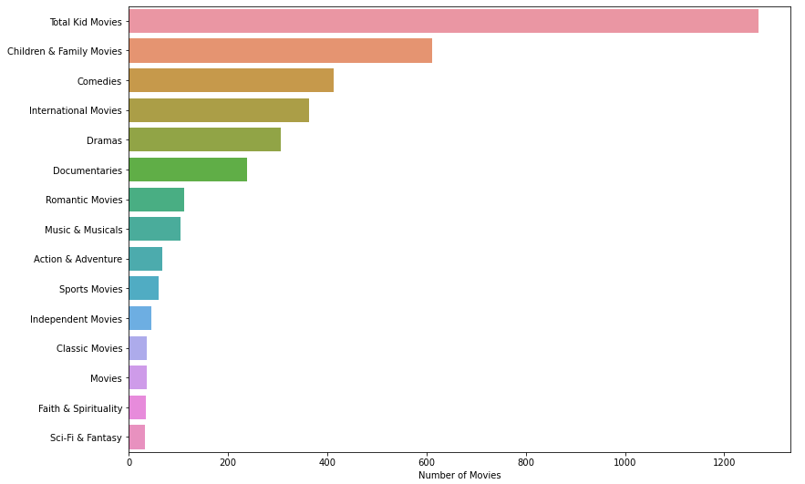  
About 50% of movies with 'Kids' rating_category are of the Children & Family Movies genre.  
This means about 50-57% of tv shows/movies under rating_category = 'Kids' are definitively meant to appeal to Children viewers.  

This number would amount to:  
(1269 x 50%)Movies + (789 x 57%)TV Shows = 1092~ netflix children content.  
Out of 8807 total netflix content, 12.39% is truly targeted at children.  

#### Teens Rating Category by TV Show Genres  
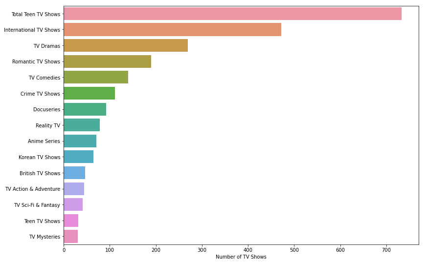  

#### Teens Rating Category by Movie Genres  
  

Content in the 'Teens' rating_category are similar across TV Shows and Movies. Dramas, Comedies, and Romance are among the top genres.

Interestingly, the 'Teen TV Shows' genres is not very high ranked for content in the 'Teens' rating_category.  
Apart from losing out to the more common genres, it is also ranked below Anime Series and Korean TV Shows genres.  

Dramas are the most popular in both TV Shows and Movies.  
Romance is more common in TV Shows as compared to Movies.  
Action & Adventure is significantly more common in Movies as compared to TV Shows.  

#### Teens Rating Category by TV Show Genres   
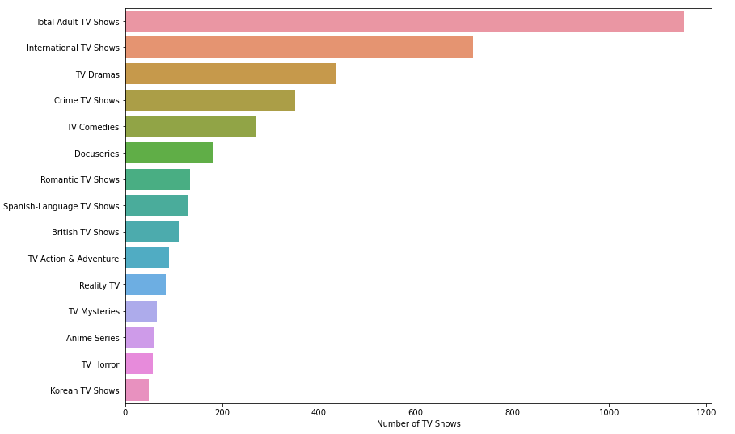    

#### Adult Rating Category by Movie Genres   
    

Content in the 'Adults' rating_category have Dramas and Comedies as the top genres. The Romance genre fell significantly in the rankings as compared to content in the 'Teens' rating_category.  

Dramas are the most popular in both TV Shows and Movies.   
The crime genre is more common in TV Shows as compared to Movies and the Action & Adventure genre is more common in Movies as compared to TV Shows.  

Comedies and Dramas are the most popular genres across all 3 rating_category. Movies are similar between Adults and Teens in genre rankings, while for TV shows, Adults lean towards the Crime genre while Teens towards the Romance genre.  

### Date
The date columns is populated as follows:  
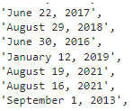    

I break the date down for further exploration.  
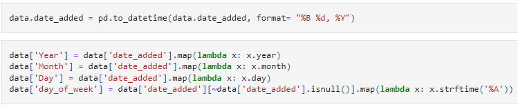    

#### Yearly Content Additions
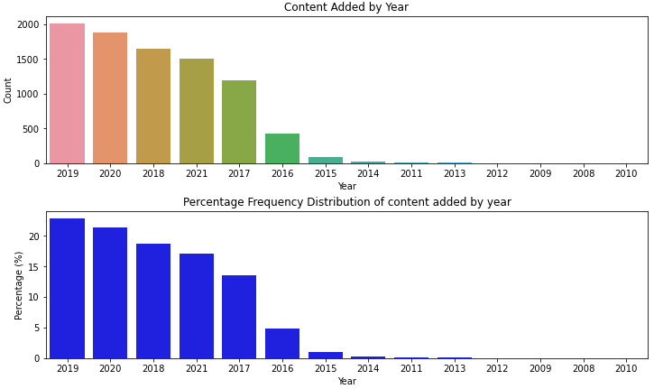   
Netflix started ramping up their content addition since 2016. Lets see how "up to date" do they keep with new additions.  

#### Time difference between release_year and date_added
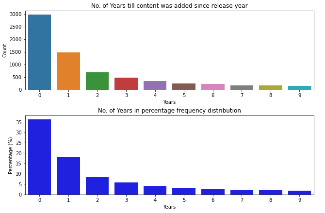  
About 36% of content is added to Netflix within the content's year of release.  

#### Monthly Content Additions
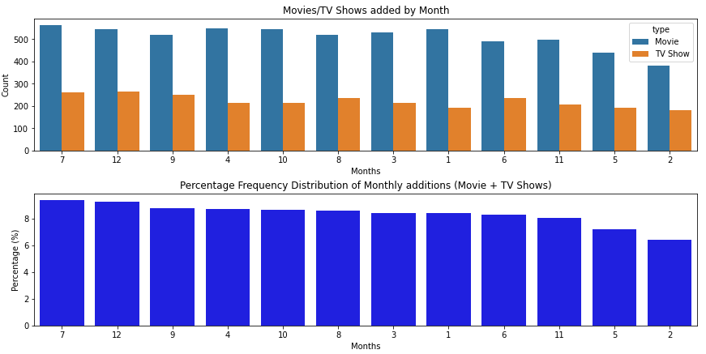   
Addition of content is fairly consistent across each month, with the most number of content additions being in July and December, with July having slightly more Movies than TV shows and vice versa for December.
February and May have the least number of additions with February having about 30% less additions compared to July.

The lower numbers in May and February are unusual. Check if data is added monthly:    
     
Every month since 2016 has had content additions apart from October 2021.  

#### Daily Content Additions  
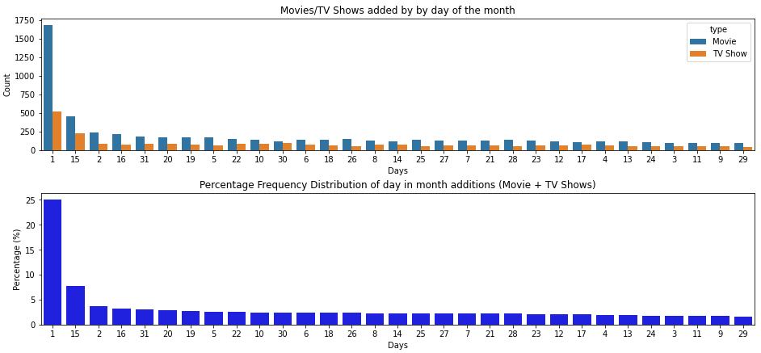      
Day of Month additions are highest on the 1st and 15th day of each month.    

If we added up the content additions on 31st and 30th, (for last day of month less February) we would have the last day of the month at the 3rd highest rank in the percentage frequency.  

Seeing how close days 2 and 16 are to the top ranks compared to the rest of the other days, it is likely that Netflix does it's large content additions at the start, middle, and end of the month over the span of 2 days.  

#### Day of Week Content Additions  
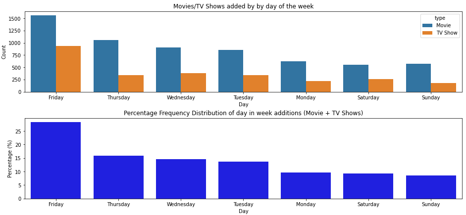   
Content Additions occur the most on Friday and the least on the Weekends (Saturday and Sunday) and the first day of the week (Monday).

### Country
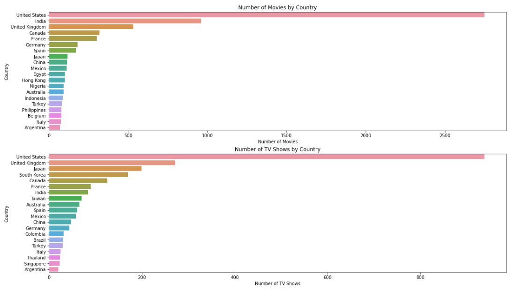   
TV Shows from Japan and South Korea are more prevalent in the content that netflix provides. This is interesting because Movies are the predominant content on Netflix.  Netflix could have a significant amount of viewership in Japan and South Korea, but this does not explain why the movie count is lower from both South Korea and Japan.  Perhaps Japanese and South Korean TV shows have more appeal to an international audience.  

#### Japanese TV Show Genres  
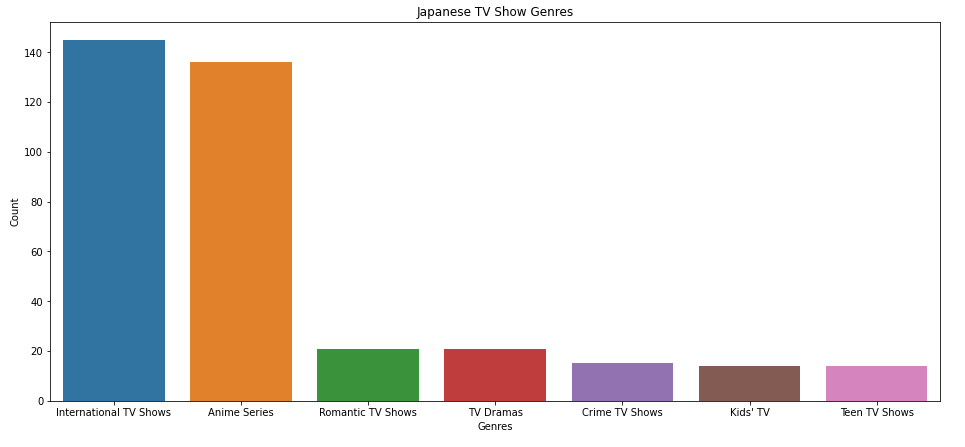    
'International TV Shows' as a genre does not exactly help in differentiating the TV Shows. Anime Series is a more apt descriptor.    
International TV Shows and Anime Series make up the bulk of Japanese TV Shows.    
 
Filter all Japan TV Shows by genre = 'International TV Shows' to see how many International TV Shows also overlap as an Anime Series.    
    
Of the 145 International TV Shows, 105 of the shows are Anime Series.  
This means a large majority of Japanese TV Shows are Anime Series.  

#### South Korean TV Show Genres  
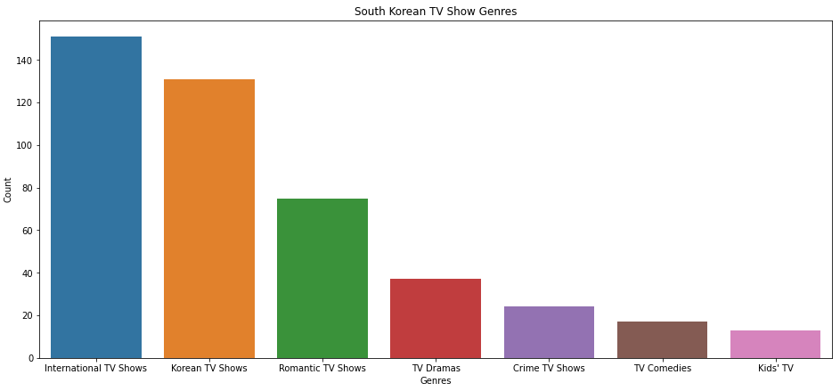   
Similar to Japan's TV Shows, 'International TV Shows' are the bulk of Korean TV Shows.
 
Filter all South Korean TV Shows by genre = 'International TV Shows' to see how many International TV Shows also overlap as Korean TV Shows.  
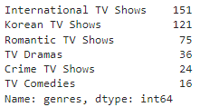   
Of the 151 International TV Shows, 121 of the shows are Korean TV Shows.  
Of the 131 Korean TV Shows, 10 are not international.  

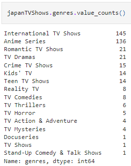   

